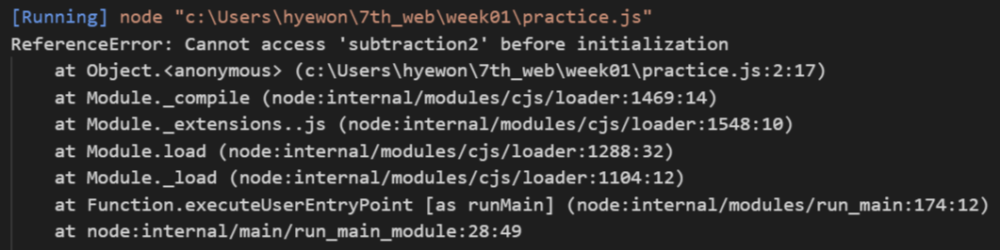

- 원시 타입 🍠
    
    ### 원시 타입 (Primitive Type)
    
    자바스크립트에서 원시타입은, 쉽게 정의하면 객체가 아닌 다른 모든 타입을 의미합니다. 객체가 아니기에, 이러한 원시 타입은 메서드를 갖고 있지 않습니다. 
    
    - boolean
        
        ### boolean
        
        거짓과 참을 가질 수 있는 데이터 타입입니다. 주로 조건문에서 많이 사용됩니다.
        
        true / false와 같은 boolean 형의 값 외에도 조건문에서 마치 true와 false 처럼 취급되는 truthy, falsy 값이 존재한다.
        
        ```jsx
        if (1) {
        	// 1을 true로 사용할 수 있다.
        }
        
        if (0) {
        	// 0을 false로 사용할 수 있다.
        }
        
        if (NaN) {
        	// NaN을 false로 사용할 수 있다.
        }
        
        // 그 외에도 null / undefined / 공백이 없는 빈 문자열도 falsy한 값이다.
        ```
        
    - null
        
        ### null
        
        아직 값이 없거나, 비어 있는 값을 표현할 떄 사용합니다. 
        
        의도적으로 변수에 값이 없음을 표현하고 싶을 때 null을 사용합니다.
        
        ```jsx
        let matthew = null;
        console.log(matthew);  // null
        ```
        
        null이 가지고 있는 특별한 점은 다른 원시 타입 값과 다르게 타입을 체크했을 때, ‘object’라는 결과가 반환 된다는 점 입니다.
        
        ```jsx
        typeof null === 'object'; // true
        ```
        
        왜 이렇게 개발했을지 의문을 충분히 갖을 수 있습니다. 이는, 초창기 자바스크립트, 개발 시 발생한 문제이고 **`typeof null을 진짜로 null로 표현하고자 하는 많은 시도`**가 있지만, 호환성 문제가 다른 코드에 영향을 주어 받아들여지지 않았다고 합니다.
        
        
    - undefined
        
        ### undefined
        
        `undefined`는 선언한 후 값을 할당하지 않은 변수. 즉, 아직 변수 또는 프로퍼티가 할당되지 않았음을 의미합니다.
        
        ```jsx
        let matthew;
        matthew // undefined;
        
        const matthewObject = {};
        matthewObject.key; // undefined
        ```
        
    - number 🍠
        
        자바스크립트는 bigint가 등장하기 전에는, 모든 숫자를 number라는 타입에 넣기 시작했다.
        
        ECMAScript 표준에 따르면 
        
        $$
        -(2^{53}-1)과 2^{53}-1
        $$
        
        사이의 값을 저장할 수 있다.
        
        ```jsx
        42; // 정수 리터럴
        3.14159; // 부동 소수점 리터럴
        0b1010; // 2진수 리터럴 (binary literal)
        0o755; // 8진수 리터럴 (octal literal)
        0x1A3; // 16진수 리터럴 (hexadecimal literal)
        
        // 천 단위를 읽기 쉽게 해주는 표현(가독성)
        1_000_000; // 숫자 구분 기호 (Numeric Separators)
        ```
        
        - JS에서 사칙연산을 하는 방법을 작성해주세요. 🍠
            - 더하기
                
                연산자 `+` 를 사용한다.
                
                ```jsx
                console.log(3+3);
                //6
                ```
                
            - 빼기
                
                연산자 `-` 를 사용한다.
                
                ```jsx
                console.log(4-1);
                //3
                ```
                
            - 곱하기
                
                연산자 `*` 를 사용한다.
                
                ```jsx
                console.log(3*3);
                //9
                ```
                
            - 나누기
                
                연산자 `/` 를 사용한다.
                
                ```jsx
                console.log(6/2);
                //3
                ```
                
            - 나머지 구하기
                
                연산자 `%` 를 사용한다.
                
                ```jsx
                console.log(6%4);
                //2
                ```
                
            - 거듭 제곱
                
                연산자 `**` 를 사용한다.
                
                ```jsx
                console.log(4**2);
                //16
                ```
                
        - JS에서 비교 연산을 하는 여러가지 방법을 조사하여 정리해주세요. 🍠
            
            비교 연산자를 사용한다.
            
            `>`  왼쪽 값이 오른쪽 값보다 큰지 비교한다.
            
            `<`  왼쪽 값이 오른쪽 값보다 작은지 비교한다.
            
            `>=` 왼쪽 값이 오른쪽 값보다 크거나 같은지 비교한다.
            
            `<=` 왼쪽 값이 오른쪽 값보다 작거나 같은지 비교한다.
            
            `==` 왼쪽 값과 오른쪽 값이 같은지 비교한다. 데이터형은 비교하지 않는다.
            
            `!=` 왼쪽 값과 오른쪽 값이 같지 않다.
            
            `===`  왼쪽 값과 오른쪽 값이 같은지 비교한다. 데이터형도 같은지 비교한다.
            
            `!==`  왼쪽 값과 오른쪽 값이 같지 않거나 데이터가 같지 않다.
            
        - JS에서 증가/감소 연산을 하는 여러가지 방법을 조사하여 정리해주세요. 🍠
            
            증가 연산자와 감소 연산자를 사용한다.
            
            `++` 1씩 더한다.
            
            `--` 1씩 뺀다.
            
        - 연산자 우선순위에 대해 작성해주세요. 🍠
            
            괄호 > 단항 연산자 > 산술 연산자 > 비교 연산자 > 논리 연산자 > 대입 연산자
            
    - string 🍠
        
        ### string
        
        <aside>
        💡 string 타입에 대해, 직접 구글링하여 아래에 정리해주세요.
        
        </aside>
        
        문자열을 표현하는데 사용되는 데이터 타입이다. 문자열은 객체로서 활용 가능한 `property`와 `method`를 가지고 있다. 또한 객체에 의존적이면서 객체의 수행을 담당하는 메서드를 가지고 있다.
        
        ```jsx
        console.log("hello".length);
        ```
        
        문자열이 가지고 있는 property인 length로 문자열의 길이를 알 수 있다.
        
        ```jsx
        console.log("hello world".replace("hello", "hi"));
        //hello가 hi로 바뀐다.
        
        console.log("hello world".toUpperCase());
        //HELLO WORLD로 바뀐다.(문자열이 대문자로 바뀐다.)
        ```
        
        `replace`, `toUpperCase` 등과 같은 method를 가진다.
        
    - symbol
        
        ### Symbol
        
        Symbol 타입은 ES6에서 새롭게 추가된 7번쨰 타입입니다. 중복되지 않는, 고유한 값들을 나타내기 위해서 만들어 졌습니다. 심벌을 생성하기 위해서는 `Symbol()`을 사용해야 합니다.
        
        왜 Symbol을 사용할까요?
        
        아래의 yongmin이라는 사람도 Matthew라는 영어 이름을 갖고 있고, sua 라는 사람 또한 Matthew 라는 영어 이름을 갖고 있다고 합시다.
        
        ```jsx
        const yongmin = 'Matthew';
        const sua = 'Matthew';
        ```
        
        둘을 `일치 연산자(===)`로 비교하면 어떻게 될까요?
        
        ```jsx
        yongmin === sua // true
        ```
        
        당연히 true가 나옵니다.
        
        하지만, 우리가 원하는 시나리오는, 용민이라는 사람과, 수아라는 사람은 엄연히 다른 사람이기에, false가 나오기를 원한다고 가정해봅시다. 이런 경우 **`Symbol을 활용`**할 수 있습니다.
        
        ```jsx
        const yongmin = Symbol('Matthew');
        const sua = Symbol('Matthew');
        ```
        
        다시 `일치 연산자(===)`로 비교해봅시다.
        
        ```jsx
        yongmin === sua // false
        ```
        
        이처럼 중복되지 않는 어떠한 고유한 값을 나타내고 싶으면 **`Symbol 타입`**을 활용하는 것이 매우 유용합니다.
        
    - bigint 🍠
        
        ### bigint
        
        <aside>
        💡 bigint 타입에 대해, 직접 구글링하여 아래에 정리해주세요.
        
        </aside>
        
        `number` 원시 값이 안정적으로 나타낼 수 있는 최대치인 2^53 - 1 보다 큰 정수를 표현할 수 있는 내장 객체이다. 정수 리터럴의 뒤에 `n`을 붙이거나 함수 `BigInt(`)를 호출하면 된다. 
        
        ```jsx
        const a = 9007199254740991n;
        const b = BigInt(9007199254740991n);
        const c = BigInt("0x1fffffffffffff");
        ```
        
- 객체 타입 🍠
    
    ### 객체 타입 (Object Type)
    
    위의 7개 원시 타입 제외 자바스크립트를 이루고 있는 대부분의 타입이 바로 객체 타입입니다. 여기에는 배열, 함수, 정규식, 클래스 등이 포함된다.
    
    여기서 한 가지 주목할 것이 **`객체 타입은 참조를 전달`**하기에, **`참조 타입`**으로도 불린다는 것이다.
    
    ```jsx
    const hello1 = () => {}; 
    const hello2 = () => {};
    ```
    
    위의 내용을 보면 실제로, 함수의 내용이 같아 보입니다. 하지만, 서로의 참조가 다르기에 false가 반환됨을 알 수 있습니다.
    
    ```jsx
    hello1 === hello2 // false
    ```
    
    - 배열
        
        ### 배열 (Array)
        
        자바스크립트에서 배열을 만드는 방법
        
        1. **`배열 리터럴 []`** 
        
        ```jsx
        // 배열 리터럴 [] 를 사용하여 만드는 방법
        let matthew = [];
        
        // 각각 인덱스를 [] 안에 넣어, 배열 안에 값을 할당할 수 있다.
        matthew[0] = 'kim';
        matthew[1] = 'yong';
        matthew[2] = 'min';
        
        // i = 0 부터, matthew의 길이 총 3(['kim', 'yong', 'min'], i++ (하나씩 증가)
        for (let i = 0; i < matthew.length; i++) {
        	console.log(matthew[i]);
        }
        ```
        
        ```jsx
        // 배열 생성 (초기 값 할당)
        let arr = ['kim', 'yong', 'min'];
        
        // 배열의 크기를 미리 지정하기
        let arr = [,,,]; // undefined가 출력된다.
        ```
        
        1. **Array() 생성자 함수로 배열 생성**
        
        배열 생성
        
        ```jsx
        // 배열 생성
        let arr = new Array();
        
        arr[0] = 'kim';
        arr[1] = 'yong';
        arr[2] = 'min';
        
        for (let i = 0; i < arr.length; i++) {
        	console.log(arr[i]);
        }
        
        // 값을 할당한 채로 배열을 생성할 수 있다.
        let arr = new Array('kim', 'yong', 'min');
        
        // 배열의 크기를 지정하여 생성
        let arr = new Array(3);
        
        // 배열의 크기를 지정하여 생성한 후 원하는 값으로 채워넣을 수 있다.
        new Array(20).fill(0);
        
        // output: [0, 0, 0, 0, 0, 0, 0, 0, 0, 0, 0, 0, 0, 0, 0, 0, 0, 0, 0, 0]
        ```
        
        - 다양한 `Array method`에 대해 정리해주세요. 🍠
            - sort 🍠
                
                배열의 요소를 적절한 위치에 정렬한 후 그 배열을 반환한다.
                
            - join 🍠
                
                배열의 모든 요소를 쉼표나 지정된 구분 문자열로 구분하여 연결한 새 문자열을 만들어 반환한다.
                
            - reverse 🍠
                
                배열의 순서를 반전한다.
                
            - splice 🍠
                
                배열의 기존 요소를 삭제 또는 교체하거나 새 요소를 추가하여 배열의 내용을 변경한다.
                
            - slice 🍠
                
                어떤 배열의 `begin`부터 `end`까지에 대한 복사본을 새로운 배열 객체로 반환한다.
                
            - find 🍠
                
                제공된 배열에서 제공된 테스트 함수를 만족하는 첫 번째 요소를 반환한다. 만약 만족하는 값이 없으면 `undefined`가 반환된다. 
                
            - filter 🍠
                
                주어진 배열의 일부에 대한 복사본을 생성한다. 그리고 주어진 배열에서 제공된 함수에 의해 구현된 테스트를 통과한 요소로만 필터링한다.
                
            - map 🍠
                
                배열 내 모든 요소 각각에 대하여 주어진 함수를 호출한 결과를 모아 새로운 배열을 반환한다.
                
            - reduce 🍠
                
                배열의 각 요소에 대해 주어진 `reducer` 함수를 실행하고 하나의 결과값을 반환한다. 
                
            - some  🍠
                
                배열 안의 어떤 요소라도 주어진 판별 함수를 적어도 하나라도 통과하는지 테스트한다. 
                
            - every 🍠
                
                배열의 모든 요소가 제공된 함수로 구현된 테스트를 통과하는지 확인한다. `boolean` 값을 반환한다.
                
            - forEach 🍠
                
                각 배열 요소에 대해 제공된 함수를 한 번씩 실행한다.
                
    - 함수
        
        ### 함수 (function)
        
        ### 함수 선언문
        
        ```jsx
        function subtraction(a, b) {
        	return a - b;
        }
        
        subtraction(5, 3); // 2
        ```
        
        함수 선언문은 표현식이 아닌 일반 문(statement)으로 분류
        
        ### 함수 표현식
        
        ```jsx
        let subtraction2 = function (a, b) {
            return a - b;
        }
        
        subtraction2(5, 3); // 2
        ```
        
        함수 표현식은, 함수를 변수에 할당했다.
        
        ### 화살표 함수
        
        ```jsx
        let subtraction3 = (a, b) => {
        	return a - b;
        }
        
        subtraction3(5, 3); // 2
        ```
        
        ES6에 추가된 화살표 함수도 많이 사용한다.
        
        ### 호이스팅 (Hoisting) 🍠
        
        <aside>
        💡 호이스팅에 대하여 정리해주세요, 위의 함수 선언문과, 표현식에서 예시로 든 코드를 바탕으로, 실습한 코드를 아래에 정리해주시고, 설명을 작성해주세요.
        
        </aside>
        
        호이스팅은 변수선언/함수선언이 해당 스코프의 최상단으로 끌어 올려지는 현상을 의미한다. 즉, 선언이 먼저 메모리에 저장되는 것을 의미한다. 
        
        ```jsx
        console.log(subtraction(5, 3)); // 출력: 2
        
        function subtraction(a, b) {
            return a - b;
        }
        ```
        
        함수 선언문은 호이스팅된다.
        
        ```jsx
        try {
            console.log(subtraction2(5, 3)); //Error
        } catch (e) {
            console.log(e); //
        }
        
        let subtraction2 = function (a, b) {
            return a - b;
        };
        ```
        
        
        
        함수 표현식은 호이스팅되지 않는다.
        
        자바스크립트의 모든 선언에는 호이스팅이 일어난다. `let, const, class`를 이용한 선언문은 호이스팅이 발생하지 않는 것처럼 동작한다. let으로 선언된 변수는 선언문 이전에 참조하면 참조 에러`(ReferenceError)`가 발생한다. 그 이유는 let으로 선언된 변수는 스코프의 시작에서 변수의 선언까지 일시적 사각지대에 빠지기 때문이다.
        
    - 클래스
        
        ### 클래스 (class)
        
        Student라는 클래스를 만들어 보겠습니다.
        
        **`class라는 키워드를 이용`**해서 **`선언`**을 해주고, **`constructor 생성자를 이용`**해서, **`나중에 object를 만들 떄 필요한 데이터를 전달`**해주면 됩니다. 
        
        전달 받은 데이터를 class에 존재하는 필드에, 전달된 데이터를 바로 할당해줍니다.
        
        ```jsx
        // 클래스 선언
        class Student {
        	constructor(name, school) {
        		// 필드
        		this.name = name;
        		this.school = school;
        	}
        }
        ```
        
        이번엔 전달받은, 클래스의 이름과, 학교명을 갖고, 자기소개를 하는 **`methods`**를 만들어보겠습니다. 만드는 방법 또한 매우 간단합니다.
        
        ```jsx
        // 클래스 선언
        class Student {
        	constructor(name, school) {
        		// 필드
        		this.name = name;
        		this.school = school;
        	}
        	
        	// 메소드
        	introduction() {
        		console.log(`안녕하세요, ${this.name}입니다. ${this.school}에 다니고있습니다`)
        	}
        }
        ```
        
        아래와 같이 만든 클래스를 이용하여, **`new 키워드를 통해 새로운 object를 만들 수 있습니다.`** name과, school을 맞는 위치에 같이 전달해주면 됩니다.
        
        ```jsx
        const matthew = new Student('matthew', '상명대학교');
        console.log(matthew.name);
        console.log(matthew.school);
        matthew.introduction();
        ```
        
        ### 아래 내용에 대해 추가적으로 학습 후 정리해보아요! 🍠
        
        <aside>
        💡 위의 예시의 코드를 활용해서, 코드를 작성해주시고, 설명 또한 작성해주세요!
        
        </aside>
        
        - getter 🍠
            
            객체의 속성 값을 반환하는 `method`이다.
            
            ```jsx
            // 클래스 선언
            class Student {
            	constructor(name, school) {
            		// 필드
            		this._name = name;
            		this._school = school;
            	}
            	// Getter 메서드
                get name() {
                    return this._name;
                  }
                
                get school() {
                    return this._school;
                }
            	// 메소드
            	introduction() {
            		console.log(`안녕하세요, ${this.name}입니다. ${this.school}에 다니고있습니다`)
            	}
            }
            const matthew = new Student('matthew', '상명대학교');
            console.log(matthew.name);
            console.log(matthew.school);
            matthew.introduction();
            ```
            
            `getter`를 활용하면 필드에 대한 안전한 접근을 보장하면서 외부에서 속성처럼 사용할 수 있다.
            
        - setter 🍠
            
            객체의 속성 값을 설정, 변경하는 `method`이다.
            
            ```jsx
            // 클래스 선언
            class Student {
            	constructor(name, school) {
            		// 필드
            		this._name = name;
            		this._school = school;
            	}
            	// Setter 메서드
                set name(value) {
                    console.log('새로운 이름을 설정합니다: ', value);
                    this._name = value;
                }
                
                set school(value) {
                    console.log('새로운 학교를 설정합니다: ', value);
                    this._school = value;
                }
            	// 메소드
            	introduction() {
            		console.log(`안녕하세요, ${this._name}입니다. ${this._school}에 다니고있습니다`)
            	}
            }
            const matthew = new Student('matthew', '상명대학교');
            matthew.name = 'winnie';
            matthew.school = '광운대학교';
            matthew.introduction();
            ```
            
            ```
            새로운 이름을 설정합니다:  winnie
            새로운 학교를 설정합니다:  광운대학교
            안녕하세요, winnie입니다. 광운대학교에 다니고있습니다
            ```
            
            값을 새로 설정한 모습을 확인할 수 있다.

### DOM 조작 🍠


- 태그 가져오기
    
    `getElementByld()`
    
    `getElementByName()`
    
    `getElementByClassName()`
    
    `getElementByTagName()`
    
- 이벤트 리스너 추가하기
    
    `addEventListener()` 
    
    ```jsx
    element.addEventListener(event, function);
    ```
    
- 이벤트 리스너 제거하기
    
    `removeEventListener()` 
    
    ```jsx
    element.removeEventListener(event, function);
    ```
    
- 키보드와 마우스 이벤트
    
    `keyup` 사용자가 키를 뗄 때
    
    `keypress` 사용자가 눌렀던 키의 문자가 입력되었을 때
    
    `keydown` 사용자가 키를 처음 눌렀을 때
    
    `dbclick` 더블클릭
    
    `mouseup` 마우스 버튼을 뗄 때
    
    `mousedown` 마우스 버튼을 누르고 있을 때
    
    `mouseenter` 요소 위로 마우스를 움직였을 때
    
    `dragstart` 드래그 시작
    
    `dragend` 드래그 종료
    
    `mouseout` 마우스가 요소 밖으로 벗어났을 때
    
    `mouseover` 마우스를 요소 위로 올렸을 때
    
    `mousemove` 마우스를 움직일 때
    
- 태그 속성 다루기
    
    `elem.hasAttribute(name)` 속성 존재 여부 확인
    
    `elem.getAttribute(name)` 속성값 가져옴
    
    `elem.setAttribute(name, value)` 속성값 변경
    
    `elem.removeAttribute(name)` 속성값 지움
    
- 부모와 자식 태그 찾기
    
    부모 찾기
    
    ```jsx
    parent = document.querySelector('.parent');
    document.getElementsByClassName('parent')[0];
    ```
    
    자식 찾기
    
    ```jsx
    children = document.querySelector('.parent .child1');
    children = document.querySelectorAll('.parent .child1');
    ```
    
- 새로운 태그 만들기
    
    ```jsx
    let createDom = document.createElement('p'); createDom.innerHTML = '새로 생성된 p태그'
    ```
    
- 태그 복제하기
    
    `cloneNode()` 함수를 사용한다.
    
    ```jsx
    const testDiv = document.getElementById('test');
    
    const newNode = testDiv.cloneNode(true);
    const newNode = testDiv.cloneNode(false);
    
    newNode.id = 'copyNode' + idNum;